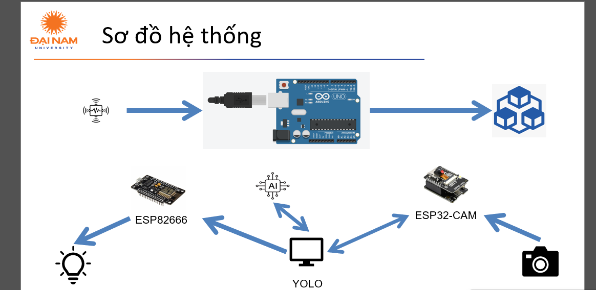
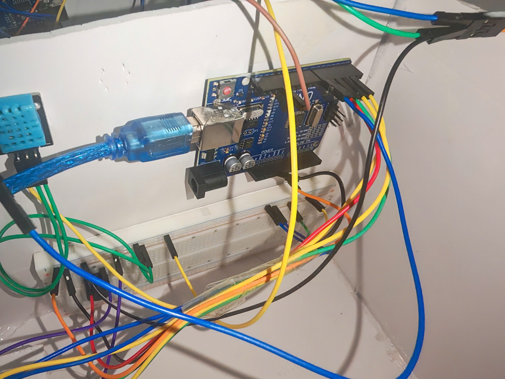
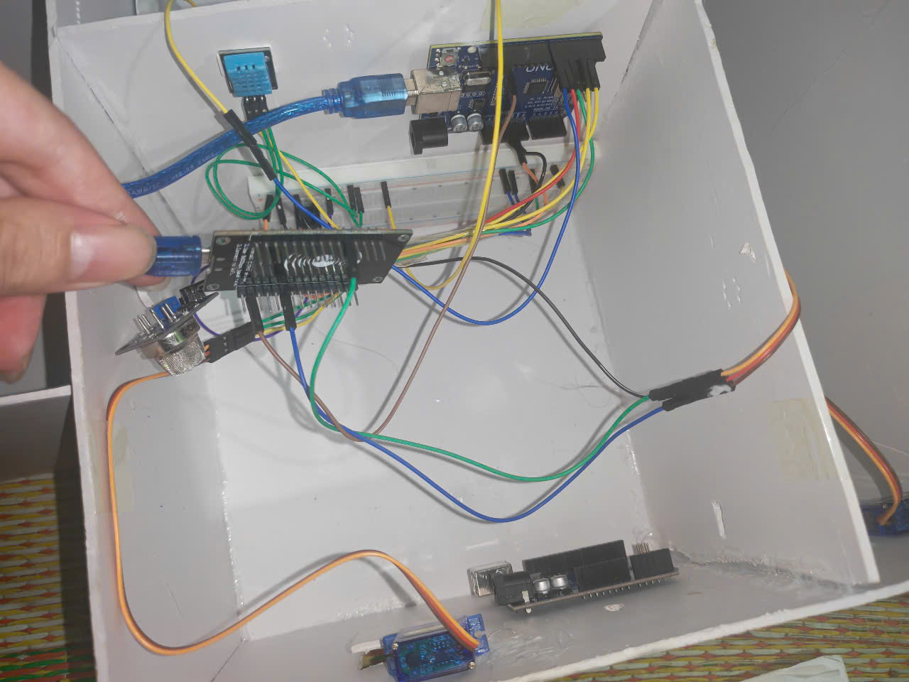
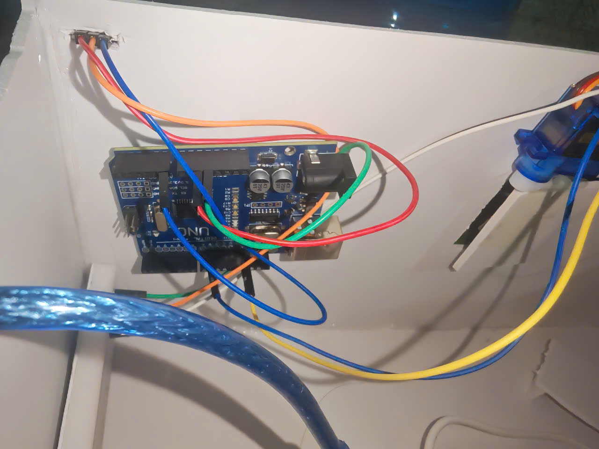
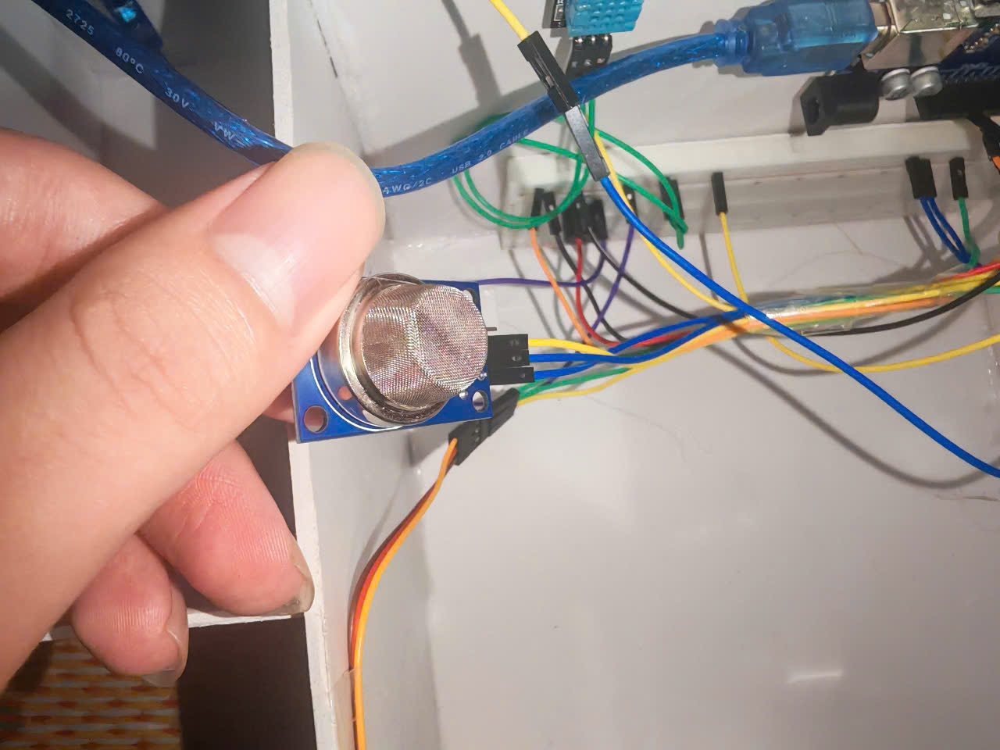
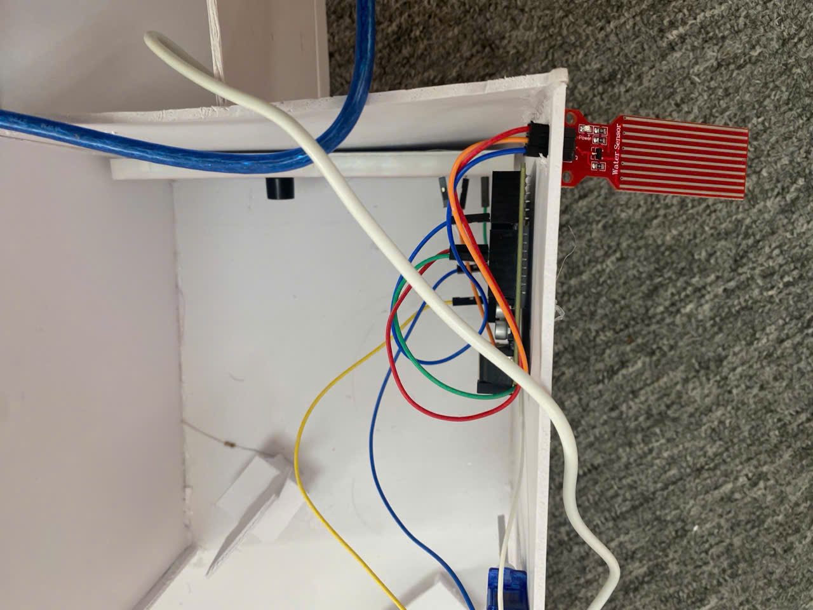

 <h1 align="center">HỆ THỐNG NHÀ THÔNG MINH</h1>

  
  

<h2 align="center">Giới thiệu hệ thống</h2>

  Hệ thống nhà thông minh giúp tự động hóa các thiết bị trong nhà, nâng cao sự tiện lợi và an toàn cho người dùng. Dự án kết hợp giữa phần cứng (Arduino, ESP8266, ESP32-CAM) và phần mềm (xử lý trên máy tính) để điều khiển các thiết bị thông minh theo thời gian thực.

---

## 🌟 Giới thiệu

- **📌 Đóng cửa khi có mưa:** Cảm biến mưa phát hiện nước, tín hiệu gửi đến Arduino để kích hoạt động cơ đóng cửa.
- **💡 Mở cửa khi rò rỉ khí gas:** Cảm biến khí gas phát hiện rò rỉ, hệ thống tự động mở cửa để đảm bảo an toàn.
- **📊 Còi báo động khi nhiệt độ cao:** Khi cảm biến phát hiện nhiệt độ vượt ngưỡng an toàn, còi báo động sẽ kích hoạt.
- **🖥️ Mở cửa khi nhận diện chủ nhân:** Sử dụng ESP32-CAM để nhận diện khuôn mặt, kết hợp với ESP8266 và máy tính trung gian để xử lý, giúp mở cửa tự động khi nhận diện đúng chủ nhân.

---
## 🏗️ HỆ THỐNG

  

---
## 📂 Cấu trúc dự án

📦 Project  
├── 📂 detectWater   # Thư mục chứa code cảm biến nước  
│   ├── mucnuoc.ino   # Mã nguồn Arduino điều khiển micro servo  
├── 📂 Temperature - Gas  # Thư mục chứa code cảm biến khí gas và nhiệt độ  
│   ├── nhietdokhiga.ino   # Mã nguồn Arduino điều khiển LED (xanh/đỏ) và còi  
├── 📂 FaceID  
│   ├── 📂 detectPeople  # Thư mục chứa code trung gian xử lý nhận diện chủ nhân  
│   │   ├── 📂 venv      # Thư mục của môi trường ảo  
│   │   ├── 📂 owner_images # Thư mục lưu trữ ảnh của người nhận diện  
│   │   ├── detectPeople.py # Mã nguồn xử lý việc nhận diện người và truyền lệnh về cho ESP8266  
│   │   ├── yolo11n.pt # File code modal được YOLO xây dựng sẵn 
│   ├── 📂 esp32Cam      # Thư mục chứa code ESP32-CAM  
│   │   ├── esp32Cam.ino # Mã nguồn Arduino cấu hình esp32cam
│   ├── 📂 Esp8266       # Thư mục chứa code ESP8266 
│   │   ├── Esp8266.ino # Mã nguồn Arduino cấu hình esp8266 và phần dùng để điều khiển micro servo  

---

## 🛠️ CÔNG NGHỆ SỬ DỤNG

### 📡 Phần cứng

  
  
  
  

### 🖥️ Phần mềm

## 🛠️ Yêu cầu hệ thống

### 🔌 Phần cứng
- **Arduino Uno** (hoặc board tương thích)
- **3 micro servo**.
- **2 còi**.
- **1 cảm biến nước**.
- **1 Esp8266**.
- **1 Esp32Cam**.
- **1 cảm biến nhiệt độ**.
- **Cáp USB , Cáp TypeC** để kết nối Arduino , Esp32Cam với máy tính.

### 💻 Phần mềm
- **🐍 Python 3+**
- **⚡ Arduino IDE** .

### 📦 Các thư viện Python cần thiết
Cài đặt các thư viện bằng lệnh:
    pip install ultralytics opencv-python numpy torch torchvision
    python -m venv .venv
## 🧮 Bảng mạch

 
 
 
  
   

### 🔩 Kết nối phần cứng:

## 🚀 Hướng dẫn cài đặt và chạy
1️⃣ **Chuẩn bị phần cứng**  
- **Nạp mã Arduino với phần cảm biến nước**:  
  1. Mở file `mucnuoc.ino` bằng Arduino IDE.  
  2. Kết nối board Arduino với máy tính.  
  3. Nạp (upload) mã nguồn lên board.  
- **Nạp mã Arduino với phần cảm biến nhiệt độ và khí gas**:  
  1. Mở file `nhietdokhiga.ino` bằng Arduino IDE.  
  2. Kết nối board Arduino với máy tính.  
  3. Nạp (upload) mã nguồn lên board.  
- **Nạp mã Arduino với Esp8266 và Esp32Cam, code xử lý trung gian**:  
  1. Mở file `Esp8266.ino` bằng Arduino IDE.  
  2. Nhập WiFi và password, chạy chương trình và lưu địa chỉ IP của Esp8266.  
  3. Mở file `esp32Cam.ino` bằng Arduino IDE.  
  4. Nhập WiFi và password, chạy chương trình và lưu địa chỉ IP của Esp32Cam.  
  5. Nhập địa chỉ IP của Esp8266 và Esp32Cam vào file.  
2️⃣ **Cài đặt thư viện Python**: Cài đặt Python 3 nếu chưa có, sau đó cài đặt các thư viện cần thiết bằng pip.  
3️⃣ **Chạy các chương trình**: Chạy lệnh `python detectPeople.py`.  

## ⚙️ Cấu hình & Ghi chú

1. Môi trường mạng: 
- esp32Cam, Esp8266 và máy tính cần kết nối cùng mạng với máy chủ.

## 📰 Poster

  

## 🤝 Đóng góp
Dự án được phát triển bởi 4 thành viên:

| Họ và Tên            | Vai trò                  |
|----------------------|--------------------------|
| Nguyễn Ngọc Bảo Long | Phát triển toàn bộ mã nguồn, thiết kế cơ sở dữ liệu, kiểm thử, triển khai dự án và thực hiện video giới thiệu.|
| Vũ Đức Minh          | Biên soạn tài liệu Overleaf, Poster, Powerpoint, thuyết trình, đề xuất cải tiến, và hỗ trợ bài tập lớn.|
| Nguyễn Đình Khánh    | Thiết kế slide PowerPoint, hỗ trợ bài tập lớn.  |
| Nguyễn Đức Đại       | Hỗ trợ bài tập lớn       |

© 2025 NHÓM 5, CNTT16-02, TRƯỜNG ĐẠI HỌC ĐẠI NAM
